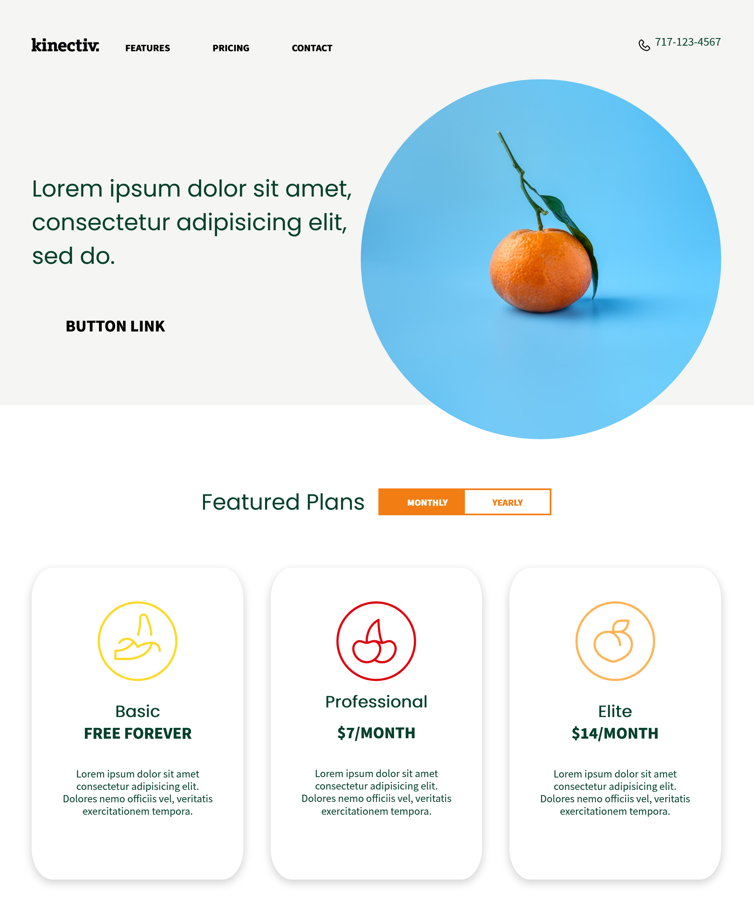

<!-- PROJECT LOGO -->
 

  

  <h3 align="center">Mockup 1</h3>

  

    Took a mockup image created in PS and made a webpage to match the specifications!
     
     
    <a href="https://jeiku.github.io/mockup-to-web1"><strong>View Demo »</strong></a>
  

<!-- TABLE OF CONTENTS -->

  
Table of Contents

  <ol>
    <li>
      <a href="#about-the-project">About The Project</a>
    </li>
    <li><a href="#license">License</a></li>
  </ol>

<!-- ABOUT THE PROJECT -->

## About The Project

 

A landing page that was designed in PS and built according to specifications! Only matches image, not responsive!

<!-- LICENSE -->

## License

Distributed under the MIT License. See `LICENSE` for more information.
